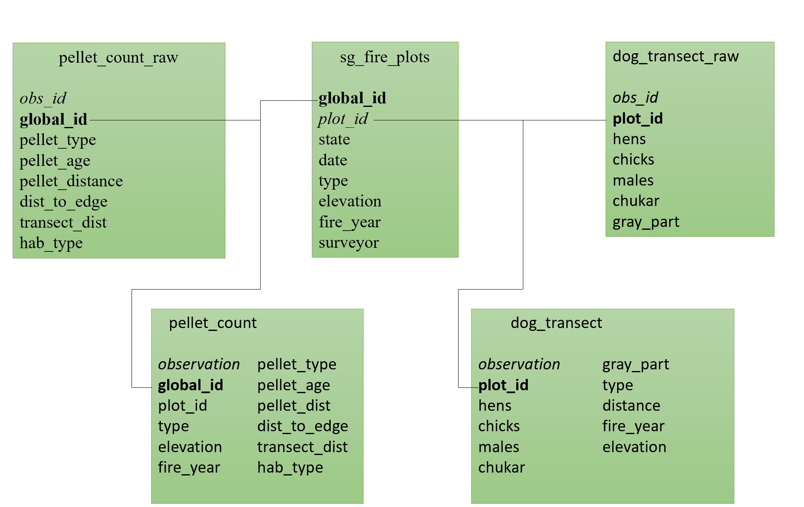

--- 
title: "Greater Sage-grouse and Wildfire"
author: "Ruger Carter"
date: "`r Sys.Date()`"
site: bookdown::bookdown_site
documentclass: book
bibliography: [book.bib, packages.bib]
# url: your book url like https://bookdown.org/yihui/bookdown
# cover-image: path to the social sharing image like images/cover.jpg
description: |
  This is a minimal example of using the bookdown package to write a book.
  The HTML output format for this example is bookdown::gitbook,
  set in the _output.yml file.
link-citations: yes
github-repo: rstudio/bookdown-demo
---

# Creating the Sage-grouse Fire Database

```{r setup, include=FALSE}
knitr::opts_chunk$set(echo = TRUE)
```

## Database Diagram

This is a diagram of my data. Primary keys are italicized. Foreign keys are 
shown in bold. sg_fire_plots table contains the data for individual plots. The 
pellet_count_raw table includes data recorded during pellet count surveys. The 
dog_transect_raw table includes data recorded during pointing dog surveys. 

```{r image, fig.cap="Database Diagram", fig.align='center', out.width='100%'}

```

## Creating the database
This is the code I used to create the database. We'll start with loading the
`DBI` and ``RSQLite` Packages.

```{r pkg, eval = TRUE}
library(DBI)
library(RSQLite)
```

First, we're going to start by establishing a connection to a SQLite database. 

```{r connection, eval = TRUE}
sg_db <- dbConnect(RSQLite::SQLite(), "../sg.db")
```

## Creating the sage-grouse fire plot data

This table includes all plot data that we sampled using pointing dogs and pellet
counts.

```{r sg_fire_plots_table, eval = FALSE, echo = TRUE}

#create sg_fire_plot table
dbExecute(sg_db, "CREATE TABLE sg_fire_plots (
          global_id,
          plot_id varchar(5) NOT NULL,
          state varchar(2) CHECK (state IN ('Idaho', 'Utah')),
          date,
          type char (1) CHECK (type IN ('B','C')),
          elevation char (4),
          fire_year char (4),
          surveyor,
          PRIMARY KEY (plot_id)
          );")

sg_fire_plots <- read.csv("../Data/raw_data/sg_fire_plots.csv")
names(sg_fire_plots)

#Enter data from CSV into table
dbWriteTable(sg_db, "sg_fire_plots", sg_fire_plots, append = TRUE)

```

This is what the content of the table looks like:

```{r show-sg_fire_plots}
#check data
dbGetQuery(sg_db, "SELECT * FROM sg_fire_plots LIMIT 10;")
```

## Pellet Count Data

This table includes all the pellet count data collected on the plots.
```{r pellet_count_raw_table, eval =FALSE, echo = TRUE}
#Create table for pellet count data
dbExecute(sg_db, "CREATE TABLE pellet_count_raw (
          obs_id PRIMARY KEY NOT NULL,
          global_id,
          pellet_type varchar (15),
          pellet_age varchar (8),
          pellet_dist varchar (5),
          dist_to_edge varchar (5),
          transect_dist varchar (5),
          hab_type varchar (20)
          );")

#Bring in pellets data
pellet_count_raw <- read.csv("../Data/raw_data/pellet_raw.csv")

dbWriteTable (sg_db, "pellet_count_raw", pellet_count_raw, append = TRUE)

```

This is what the the contents of the table looks like

```{r show-pellet_count_raw}
#check data
dbGetQuery (sg_db, "SELECT * FROM pellet_count_raw LIMIT 10;")
```

## Dog Plot Data
This is the code where I created the dog plot table and inserted the data into
the table.

```{r dog_transect_raw_table , eval =FALSE, echo = TRUE}
#Bring in dog data
dbExecute(sg_db, "CREATE TABLE dog_transect_raw (
          obs_id PRIMARY KEY,
          plot_id varchar (5),
          hens varchar (2),
          chicks varchar (2),
          males varchar (2),
          chukar varchar (2),
          gray_part varchar (2),
          distance varchar(5)
          );")

dog_raw <- read.csv("../Data/raw_data/dog_raw.csv")

dbWriteTable(sg_db, "dog_transect_raw", dog_raw, append = TRUE)

```

This is what the data looks like.

```{r show-dog_transect_raw}

#check data
dbGetQuery (sg_db, "SELECT * FROM dog_transect_raw LIMIT 10;")

```

## Combining pellet count data with plot data

Because I am using nested data entry methods using Survey123, the data comes to
me in two separate data sheets. One sheet contains the information about the 
plot, the other sheet is all the pellet count observations. It links the two 
through a "global_id". I need to combine the two sheets to where each pellet 
observation also has the plot information. I am combining those below. 

```{r pellet_count_table , eval =FALSE, echo = TRUE}
#Combine pellet counts with plot data
dbExecute(sg_db, "CREATE TABLE pellet_count (
  observation INTEGER PRIMARY KEY,
  global_id,
  plot_id varchar(5),
  type char(1),
  elevation char (4),
  fire_year char(4),
  pellet_type,
  pellet_age,
  pellet_dist,
  dist_to_edge,
  transect_dist,
  hab_type,
  FOREIGN KEY (global_id) REFERENCES sg_fire_plots(global_id)
  FOREIGN KEY (global_id) REFERENCES pellet_count_raw(global_id)
  );")

dbExecute(sg_db, "INSERT INTO pellet_count (
global_id, plot_id, type, elevation, fire_year,pellet_type, pellet_age, 
  pellet_dist,dist_to_edge, transect_dist, hab_type)
    SELECT
    sg_fire_plots.global_id,
    sg_fire_plots.plot_id,
    sg_fire_plots.type,
    sg_fire_plots.elevation,
    sg_fire_plots.fire_year,
    pellet_count_raw.pellet_type,
    pellet_count_raw.pellet_age,
    pellet_count_raw.pellet_dist,
    pellet_count_raw.dist_to_edge,
    pellet_count_raw.transect_dist,
    pellet_count_raw.hab_type
    FROM sg_fire_plots LEFT JOIN pellet_count_raw USING (global_id)
    WHERE sg_fire_plots.global_id = pellet_count_raw.global_id
    ;")

```

This is what the final data sheet looks like. 

```{r show-pellet_count}

#check data

dbGetQuery (sg_db, "SELECT * FROM pellet_count LIMIT 10;")

```

## Combining dog transect data with plot data.

The same steps need to be done with my pointing dog transect data.

```{r dog_transect_table , eval =FALSE, echo = TRUE}
#Combine pointing dog data with plot data.
dbExecute(sg_db, "CREATE TABLE dog_transect (
  observation INTEGER PRIMARY KEY,
  plot_id varchar(5),
  type,
  fire_year,
  elevation,
  hens,
  chicks,
  males,
  chukar,
  gray_part,
  distance,
  FOREIGN KEY (plot_id) REFERENCES sg_fire_plots (plot_id)
  FOREIGN KEY (plot_id) REFERENCES dog_transect_raw (plot_id)
  );")

dbExecute(sg_db, "INSERT INTO dog_transect (
plot_id, type, fire_year, elevation, hens, chicks, males, chukar, 
gray_part, distance)
    SELECT
    sg_fire_plots.plot_id,
    sg_fire_plots.type,
    sg_fire_plots.fire_year,
    sg_fire_plots.elevation,
    dog_transect_raw.hens,
    dog_transect_raw.chicks,
    dog_transect_raw.males,
    dog_transect_raw.chukar,
    dog_transect_raw.gray_part,
    dog_transect_raw.distance
    FROM sg_fire_plots LEFT JOIN dog_transect_raw USING (plot_id)
    WHERE sg_fire_plots.plot_id = dog_transect_raw.plot_id
    ;")
```

This is what the final data sheet looks like. 

```{r show-dog_transect}

#check data

dbGetQuery (sg_db, "SELECT * FROM dog_transect LIMIT 10;")


```
